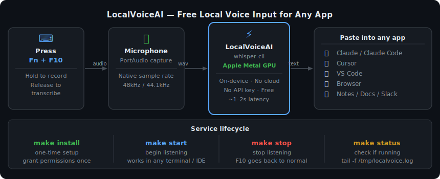
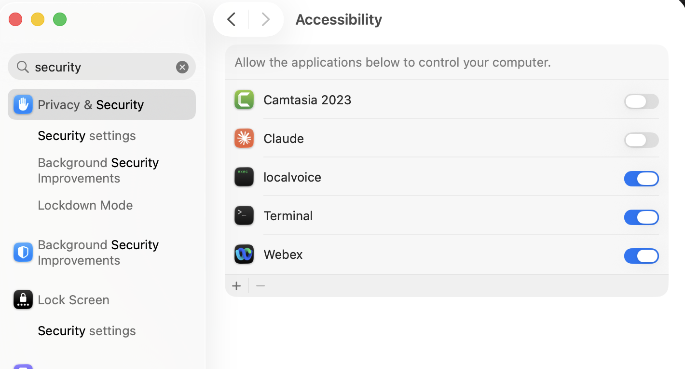
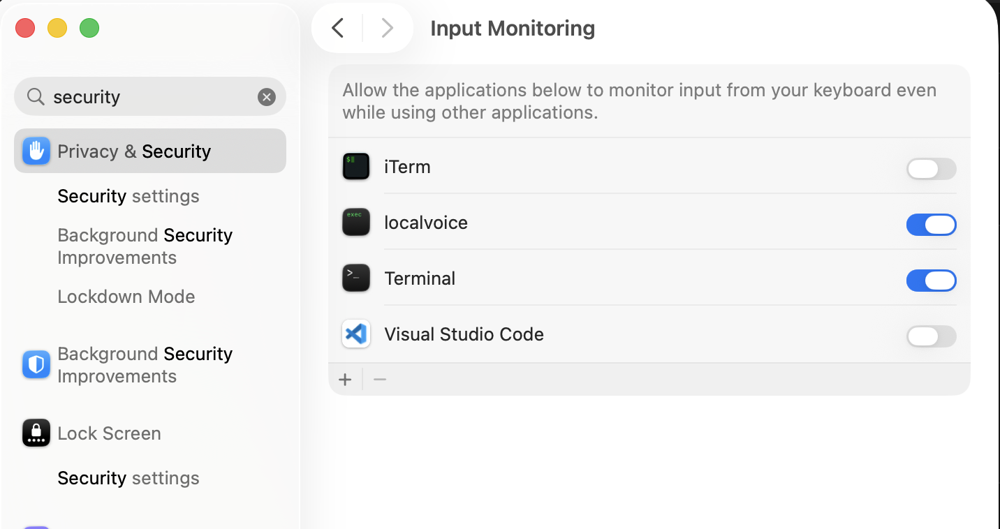

# LocalVoiceAI

**Free, local, on-device voice input for any app on your Mac.**

Start the service once. Then switch to Claude, Cursor, VS Code, your browser, or any other window — hold **Fn+F10**, speak, release. Your words appear as text, instantly, in whatever app is focused. No cloud, no API key, no subscription.



## Why LocalVoiceAI?

| | LocalVoiceAI | Cloud STT (Whisper API, etc.) |
|---|---|---|
| Cost | Free | Pay per minute |
| Privacy | Fully on-device | Audio sent to cloud |
| Latency | ~1–2s (Metal GPU) | Network dependent |
| Works offline | Yes | No |
| Setup | One-time | API key required |

## Requirements

- Apple Silicon Mac (M1 or later)
- macOS 14+
- Homebrew

## Quick Start

**1. Install dependencies**
```bash
make setup
```

**2. Build and install the service**
```bash
make install
```

**3. Grant permissions** (one-time — persists across reboots)

In System Settings → Privacy & Security, add `~/.local/bin/localvoice` to both:

**Accessibility** — allows localvoice to simulate Cmd+V paste into the active window



**Input Monitoring** — allows localvoice to detect the F10 keypress system-wide



> Both toggles must be **blue (enabled)**. If you rebuild with `make update`, re-grant both permissions as the binary hash changes.

**4. Start the service**
```bash
make start
```

That's it. Switch to any app and hold **Fn+F10** to speak.

## Usage

```bash
make start    # start listening
make stop     # stop listening
make status   # check if running
```

Check logs:
```bash
tail -f /tmp/localvoice.log
```

### Example

1. Run `make start`
2. Open Claude Code, Cursor, VS Code, a browser, or any text field
3. Hold **Fn+F10** → speak → release
4. Your speech appears as typed text in the active window

## How it works

1. **Key tap** — a C-level event tap on a dedicated thread watches for F10 key down/up
2. **Record** — PortAudio captures mic audio at the device's native sample rate (48kHz / 44.1kHz)
3. **Transcribe** — `whisper-cli` runs the Whisper model locally on Apple Metal GPU (~1–2s for a short phrase)
4. **Paste** — text is copied to clipboard and Cmd+V is simulated into the focused window

Everything runs on your machine. No data ever leaves it.

## Service management

LocalVoiceAI runs as a macOS LaunchAgent — independent of any terminal or IDE. This means it works consistently whether you launched it from Terminal, iTerm2, VS Code's terminal, or anywhere else.

| Command | What it does | Re-grant permissions? |
|---|---|---|
| `make install` | First-time setup | Yes (once) |
| `make start` | Start listening | No |
| `make stop` | Stop listening | No |
| `make reload` | Reload config (no binary change) | No |
| `make update` | Rebuild + reinstall binary | Yes |
| `make uninstall` | Remove everything | — |

## Configuration

Override the push-to-talk key:

```bash
WHISPER_KEYCODE=101 make start   # use F9 instead of F10
```

**Common keycodes:**

| Key | Code |
|---|---|
| F8  | 100 |
| F9  | 101 |
| F10 | 109 (default) |
| F11 | 103 |
| F12 | 111 |

## Models

The Whisper `ggml-small` model (~244MB) is downloaded automatically to `~/.cache/localvoice/` on first run. For different accuracy/speed tradeoffs, download another model from [HuggingFace ggerganov/whisper.cpp](https://huggingface.co/ggerganov/whisper.cpp/tree/main) and place it in `~/.cache/localvoice/`.

## Troubleshooting

**Event tap failed** — One or both permissions are missing. Re-add `~/.local/bin/localvoice` to Accessibility and Input Monitoring in System Settings.

**Doesn't work in iTerm2 / VS Code terminal** — Use `make install` + `make start` instead of running `./localvoice` directly. The LaunchAgent runs as its own process, bypassing terminal permission restrictions.

**Transcription is gibberish** — Usually a sample rate mismatch. `localvoice` auto-detects the native mic rate; no config needed.

**Permissions lost after `make update`** — The binary hash changed. Re-add `~/.local/bin/localvoice` to both permission lists after rebuilding.

## Architecture

- **Key monitoring** — `CGEventTap` (`kCGSessionEventTap`, listen-only) on a C pthread, piped to Go to avoid CFRunLoop/goroutine conflicts
- **Audio capture** — PortAudio at the mic's native sample rate
- **Transcription** — `whisper-cli` (Homebrew `whisper-cpp`) with Metal GPU acceleration
- **Paste** — `pbcopy` + `CGEventPost` simulating Cmd+V
- **Service** — macOS LaunchAgent for terminal-independent, persistent operation

## License

Apache License 2.0 — see [LICENSE](LICENSE).
